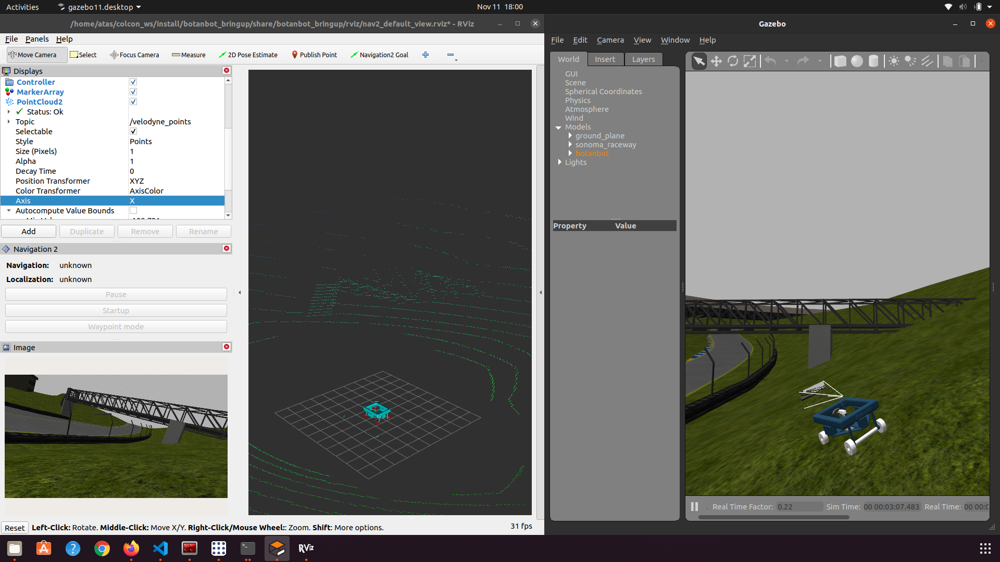
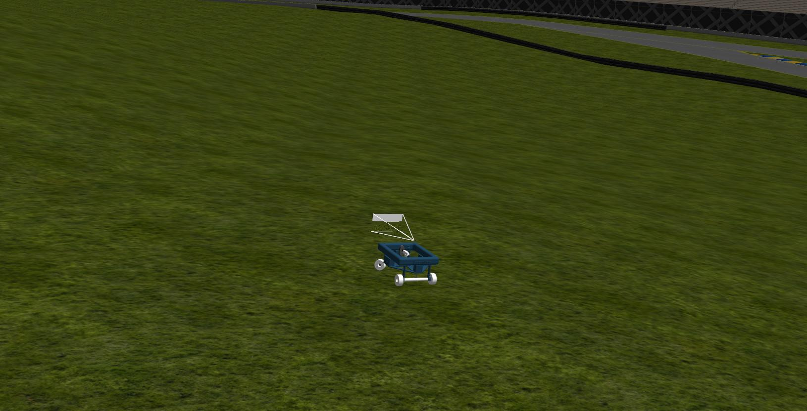

# OUTDOOR_NAV2
A project to develop/adapt a navigation system for outdoor robotics particularly aiming for use-cases in agriculture. 


This branch(foxy) is aiming for ROS2 Foxy distro, there is also `main` branch which keeps up with the latest commits from `ros2::main` and `navigation2::main`. This branch is more stable so we aim to keep major feature developments in this branch since it is more stable. 

`main` branch unstable because of constant updates from whole ROS2 ecosystem. But it is required to be there, from time to time we may need to get involved with guys at `navigation2` e.g submitting PRs or getting/pulling latest features from navigation2. Current branch is recomended to try/test/develop. 


## Roadmap
This section is aimed to keep track of development of major features.

- [x] Create an ackermann model robot under Gazebo and decorate with required sensor suite for outdoor navigation. 
- [x] Add different Gazebo worlds(farming like, city like, wild hilly world, empty world with simple shapes in it)  
- [x] Add a GUI for interaction with Robot, jogging robot manually, starting shutting down nodes  and launch files, selecting the worlds to start.
- [x] Configure `robot_localization` to obtain map->odom->base_link chain
- [x] Configure `teb_local_planner` for ackermann robot, as DWB does not work for ackermann
- [x] Test with `navigation2`, set simple goals and get in goals wtih all functionalities enabled; planner, controller, recovery, obstacle avoidance
- [x] Add GPS Waypoint following feature
- [x] Test GPS Waypoint Following feature in a city like envoirment, [Youtube video](https://www.youtube.com/watch?v=DQGfRRn1DBQ&t=13s) 
- [X] Test GPS waypoint following in tomato field [Youtube Video](https://www.youtube.com/watch?v=afxouvL1JAk), this is not pure GPS waypoint following 
- [ ] Add GPS Waypoint following to `navigation2`, Here [nav2_gps_waypoint_follower](https://github.com/ros-planning/navigation2/pull/2111), Progress about 95% 
- [ ] Add tutorial to `navigation2`, on how to make use of `nav2_gps_waypoint_follower`, PR IS OPEN [HERE](https://github.com/ros-planning/navigation2_tutorials/pull/16), Progress about 95%,
- [ ] Consider adding 3D AMCL or another 3D SLAM to help `robot_localization`, see [here](https://answers.ros.org/question/218137/using-robot_localization-with-amcl/)  
- [ ] Can [grid_map](https://github.com/ANYbotics/grid_map/tree/ros2) be beneficial to here? 
- [ ] Test GPS waypoint following on real hardware
- [ ] Add perception pipeline, at least describe a perception module. 
- [ ] Test multi-robot simulation. more than 1 botanbot doing some task collabratively.

## Quick Start

* Install ROS2 foxy. 
This is latest LTS of ROS2 distros , so it makes a lot of sense to start from this version. 
Deb installation is strongly recomended. Detailed steps to install ROS2 Foxy can be found [here](https://index.ros.org/doc/ros2/Installation/Foxy/Linux-Install-Debians/)

A few helper packages we use fro gui and installation;

```bash
sudo apt-get install python3-vcstool
sudo apt-get install xdotool
```

Finally get the project repository and dependecy repositories and build; 

```bash
source /opt/ros/foxy/setup.bash
mkdir -p ~/colcon_ws/src
cd ~/colcon_ws
wget https://raw.githubusercontent.com/jediofgever/OUTDOOR_NAV2_UNDERLAY_REPOS/main/underlay.repos
vcs import src < underlay.repos
cd ~/colcon_ws
rosdep install -y -r -q --from-paths src --ignore-src --rosdistro foxy
colcon build --symlink-install --cmake-args -DCMAKE_BUILD_TYPE=Release
``` 
You will be asked to enter your github credentials, enter them correctly, since this repo is private at the moment. 
`rosdep` might take quite long to install all required depenedencies , so please wait for that command to finish. 

You can update dependencies that are build from source such as `navigation2` or `teb_local_planner`
with this convient commands; 

```bash
cd ~/colcon_ws
vcs import src < underlay.repos
vcs pull src
```

We need the source build of some dependencies(e.g `navigation2`), sometimes we need to add/modify functionalities, overall it gives more control for the development. For future we might remove all source built dependencies, but for now the existing 3 better stay as it is since some of them are not avaliable in from debian installations. 

## Run project

The project has a RGT GUI plugin that lets you to interact with robot. To start with this plugin make sure in previous step you built project 
successfully. 

* source your colcon_ws and start the project with;

` source install/setup.bash`

` rqt --force-discover`


The rqt window should open as above. You should now find our plugin under; 

Plugins -> Visualization -> Control Plugin. 

Click on Control Plugin and you would be able to see; 


## Interact with GUI
Click on Start Gazebo Stand Alone, to start botanbot simulation. Note that the Gazebo worlds we use are large, so your computer needs to have an dedicated GPU,it takes apprx. 10 seconds for simulation to start in my case. After a while you should see Gazebo starting. 

This world is large and you may not see the Botanbot at first, At left side of Gazebo simulation, find the `models -> botanbot`
right click and then `follow` botanbot model. This should put the focus onto botanbot. 

You can also click on start RVIZ and you should be able to see sensor data and robot model in rviz ; 



This Gazebo world includes hills , up and downs which tries to be more inclusive for case of agricultural robot.

You can jog botanbot with RQT plugin, use `L/R` for giving angular speed and `D/R` for  linear speed. 

## Botanbot
Botanbot is a simple 4 wheeled , ackermann drived mobile robot. It is simulated under Gazebo with all required essential sensors in order to do outdoor navigation. The following table shows currently supported sensors. 
### Sensor support for Botanbot
| Sensor type | Topic Name(s) | Message Type | Update Rate |
| :---: | :---: | :---: | :---: |
| LIDAR | /velodyne_points | sensor_msgs::msg::PointCloud2 | 30 |
| RealSense D435 COLOR CAMERA | /camera/color/image_raw | sensor_msgs::msg::Image | 30 |
| RealSense D435 DEPTH CAMERA | /camera/aligned_depth_to_color/image_raw | sensor_msgs::msg::Image | 30 |
| RealSense D435 IR1 CAMERA | /camera/infra1/image_raw | sensor_msgs::msg::Image | 1 |
| RealSense D435 IR2 CAMERA | /camera/infra2/image_raw | sensor_msgs::msg::Image | 1 |
| GPS | /gps/fix | sensor_msgs::msg::NavSatFix | 30 |
| IMU | /imu | sensor_msgs::msg::Imu | 30 |


### Botanbot navigation in farming world


### Botanbot in Hilly Gazebo world




### Related to Google Cartographer 3D SLAM

We have added configuration package(`botanbot_cartogrpaher`) in order to build 3D maps using google cartogrpaher. The main motivation behind this is; we have thoughts about switching envoirnment representationn from 2D to 3D, in that case a global prebuilt map of envoirnment might be necesarry(e.g a `.pcd` file to load instead of `.pgm`). 

In order to use the provided configuration package, one will ned to create ros2 bag files with required topics. For now we use 1 LIDAR and 1 IMU(Can be changed to 2 LIDAR in future). In order to record a bag file this the required topics, do the following; 

```bash
ros2 bag record /velodyne_points /imu/data
```
A bag file will be created. Cartogrpaher expects that you define the rigid bost transforms between sensor links and robot body frame(base_link). This transfromas are defined in `botanbot_cartographer/urdf`. You might need to modify translation and roation between velodyne senor and imu sensor for differnt setup. A strict calibration might not be necesarry betwenn IMU and LIDAR. 

Also see the `cartogrpaher.launch.py` file and make sure the data topics are remapped correctly. After we have the bag file and configuration ready, we do the following to build the 3D map. 

```bash
ros2 launch botanbot_cartographer cartographer.launch.py use_sim_time:=true bag_file:=${HOME}/rosbag2_2020_12_18-10_25_37/rosbag2_2020_12_18-10_25_37_0.db3
```
Wait for cartogrpaher to finish and do optimizations on the map. 


### Related presentations
* [Possible ADs/CONSs of 3D enviornment rep. in Context of Uneven Terrain Nav.](assets/presentation_0.pdf)