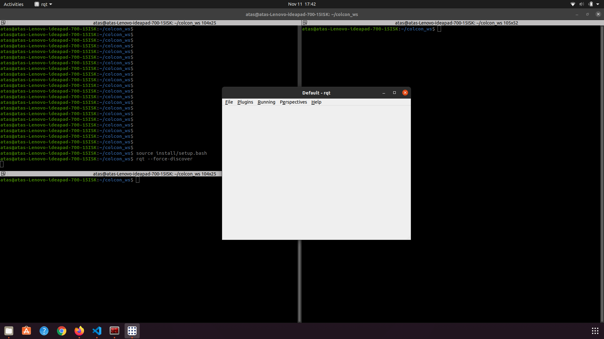
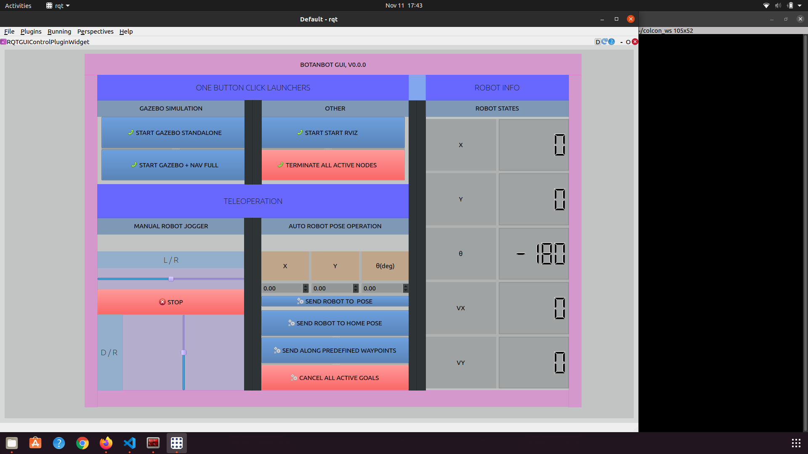

# OUTDOOR_NAV2
A project to develop/adapt a navigation system for outdoor robotics particularly aiming for use-cases in agriculture. 

## Roadmap
- [x] Create a ackermann model robot under Gazebo, and decorate with nexecesarry sensor suite  
- [x] Add different Gazebo worlds(Farming, city, race, empty)  
- [x] Add a GUI for interaction with Robot, starting, shutting down nodes  
- [x] Configure `robot_localization` to obtain map->odom->base_link chain
- [x] Configure `teb_local_planner` for ackermann robot, DWB does not work for ackermann
- [x] Test `navigation2` , set simple goals and get in goals wtih all fuinctionalities enabled; planner, controller, recovery, obstacle avoidance
- [x] Add GPS Waypoint following feature
- [x] Test GPS Waypoint Following feature in a city like envoirment, [Youtube video](https://www.youtube.com/watch?v=DQGfRRn1DBQ&t=13s) 
- [ ] Add GPS Waypoint following to `navigation2` it is here but not merged [nav2_gps_waypoiny_follower](https://github.com/ros-planning/navigation2/pull/2111); 
- [ ] Test GPS waypoint following in tomato_field world
- [ ] Add tutorial to `navigation2`, on how to make use of `nav2_gps_waypoiny_follower`
- [ ] Consider adding 3D AMCL to `robot_localization`, see [here](https://answers.ros.org/question/218137/using-robot_localization-with-amcl/)  
- [ ] Test GPS waypoint following on real hardware
## Quick Start

* Install ROS2 foxy. 
This is latest LTS of ROS2 distros , so it makes a lot of sense to start from this version. 
Deb installation is strongly recomended. Detailed steps to install ROS2 Foxy can be found [here](https://index.ros.org/doc/ros2/Installation/Foxy/Linux-Install-Debians/)

* Install Navigation2 and robot_localization.
ROS way to control mobile robots with different physical models(e.g differantial, ackermann, omnidirection). 
This can be quickly done with; 

```bash
sudo apt-get install ros-foxy-navigation
sudo apt-get install ros-foxy-robot-localization
```


* Install OUTDOOR_NAV2 packages

```bash
mkdir -p colcon_ws/src

cd colcon_ws/src

git clone https://github.com/jediofgever/OUTDOOR_NAV2.git && cd ..
```

* Install dependencies with; 

```bash
rosdep install -y -r -q --from-paths src --ignore-src --rosdistro foxy

colcon build --symlink-install --cmake-args -DCMAKE_BUILD_TYPE=Release
```

* Additional linux terminal command utility package

`sudo apt-get install xdotool`

## Run project

The project has a RGT GUI plugin that lets you to interact with robot. To start with this plugin make sure in previous step you built project 
successfully. 

* source your colcon_ws and start the project with;

` source install/setup.bash`

` rqt --force-discover`



The rqt window should open as above. You should now find our plugin under; 

Plugins -> Visualization -> Control Plugin. 

Click on Control Plugin and you would be able to see; 



## Interact with GUI
Click on Start Gazebo Stand Alone, to start botanbot simulation. Note that the Gazebo worlds we use are large, so your computer needs to have an dedicated GPU,it takes apprx. 10 seconds for simulation to start in my case. After a while you should see Gazebo starting. 

This world is large and you may not see the Botanbot at first, At left side of Gazebo simulation, find the `models -> botanbot`
right click and then `follow` botanbot model. This should put the focus onto botanbot. 

You can also click on start RVIZ and you should be able to see sensor data and robot model in rviz ; 


This Gazebo world includes hills , up and downs which tries to be more inclusive for case of agricultural robot.

You can jog botanbot with RQT plugin, use `L/R` for giving angular speed and `D/R` for  linear speed. 

## Botanbot
Botanbot is a simple 4 wheeled , ackermann drived mobile robot. It is simulated under Gazebo with all required essential sensors in order to do outdoor navigation. The following table shows currently supported sensors. 
### Sensor support for Botanbot
| Sensor type | Topic Name(s) | Message Type | Update Rate |
| :---: | :---: | :---: | :---: |
| LIDAR | /velodyne_points | sensor_msgs::msg::PointCloud2 | 30 |
| RealSense D435 COLOR CAMERA | /camera/color/image_raw | sensor_msgs::msg::Image | 30 |
| RealSense D435 DEPTH CAMERA | /camera/aligned_depth_to_color/image_raw | sensor_msgs::msg::Image | 30 |
| RealSense D435 IR1 CAMERA | /camera/infra1/image_raw | sensor_msgs::msg::Image | 1 |
| RealSense D435 IR2 CAMERA | /camera/infra2/image_raw | sensor_msgs::msg::Image | 1 |
| GPS | /gps/fix | sensor_msgs::msg::NavSatFix | 30 |
| IMU | /imu | sensor_msgs::msg::Imu | 30 |

### Botanbot in Gazebo


