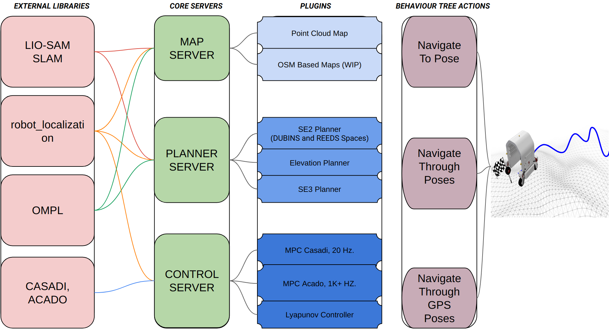

## VOX_NAV Concepts;

This project's main use case is navigation of a mobile robot in rough outdoor environments. Although the framework allows to add navigation capablities for other robots since the envoirment 
representation and planners are abstarct.

Planning of vox_nav heavily relies on OMPL, we provide SE2, Elevation, SE3 planners. Planners can also be asjusted for Ackermaan type robots with DUBINS AND REEDS-SHEEP.

It is commonly accepted that there is no universal approach that can address the navigation needs of all robot platforms. A number of established architectures have been developed based on the publish-subscribe and action-client paradigms employed by Robot Operating System (ROS) middleware. Extending on these developments, vox_nav presents a novel robotic software architecture that enables seamless integration of different robotics software components, such as Planning, Control, and Perception. The presented architecture is designed to ensure the autonomous navigation of a mobile robot operating in uneven outdoor terrains, while also supporting indoor environments with appropriate customization.  

In above illustration, we see various components that have been integrated into our navigation framework. Each sub-component (e.g., planning, localization, etc.) is linked to standard libraries; for instance, motion planning relies on the OMPL library, and localization uses the Extended Kalman Filter (robot_localization). The core servers utilize these libraries to load and operate specific plugins, these plugins are then exposed as ROS 2 `actions` and can be used to define various robot behaviors such `navigate to pose`, `navigate through poses`, etc., using a behavior tree approach.

The three server nodes, namely map server, planner server, and control server, offer
a plugin interface. This strategy facilitates the integration of numerous planning and control plugins into the system, without necessitating any code modification. Instead, a YAML configuration file can be employed for different plugin integration.