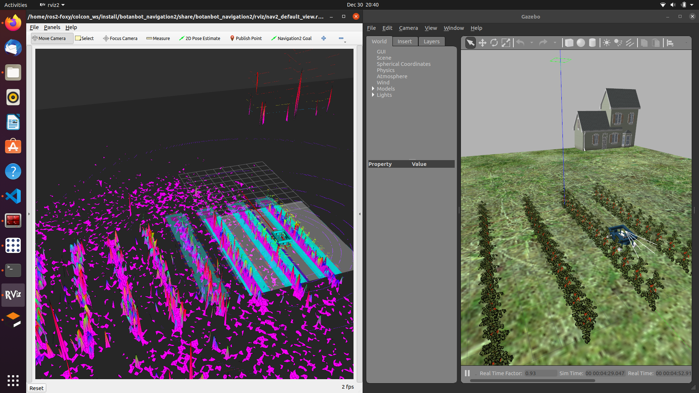

.. OUTDOOR_NAV2 documentation master file, created by
   sphinx-quickstart on Tue Dec 22 16:24:53 2020.
   You can adapt this file completely to your liking, but it should at least
   contain the root `toctree` directive.

Grid Map
========================================
`archived_botanbot_grid_map` is a package that reads a prebuilt map in .pcd format and publishes grid_map qith several layers(elevation,traversability).
The maps can be built with any SLAM algorithm, at the default we have openvslam though. 
There are several important parameters in configuration files of `archived_botanbot_grid_map`. 

.. code-block:: yaml

   archived_botanbot_grid_map_node:
   ros__parameters:
      resolution: 0.15
      pcd_file_full_path: /home/ros2-foxy/f.pcd
      map_frame: grid_map
      topic_name: grid_map
      map_publish_fps: 10
      min_points_in_cell: 1
      cloud_transform:
         translation:
         x: 0.0
         y: 0.0
         z: 0.5
         rotation: #intrinsic rotation X-Y-Z (r-p-y)sequence
         r: 3.14
         p: 1.57
         y: 1.57
      downsample_voxel_size: 0.01
      remove_outlier_mean_K: 50
      remove_outlier_stddev_threshold: 0.5

We should specify a full path to the pcd file here. There are Other important parameters related to transfrom of pcd. 
In openvslam the coordinate frames are not complying with standart ROS frames(x forward, y left, z upwards). Therefore we 
need to transfrom pcd to comply with standart ROS frames. 
There are also some PCL utilities to denoise pcd and get better map. Play with them to find best working in for each case. In simulation the above 
parameters leads to following grid maps depicted in pictures.

.. note:: we use tf_static_transform publisher to create a dedicated coordinate frame for grid_map. You can change the translation and rotation
          in mapping.launch.py. This is important, it gives us flexibility to align map with oher global localization such as GPS. But we do not have 
          done any work towards that yet.

.. code-block:: bash

   ros2 launch archived_botanbot_grid_map archived_botanbot_grid_map.launch.py 

.. image:: ../images/grid_map_1.png
   :width: 700px
   :align: center
   :alt: rqt landing screen

