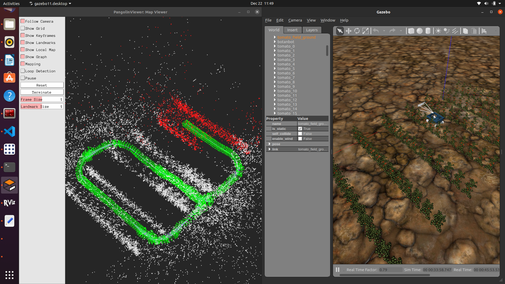

.. OUTDOOR_NAV2 documentation master file, created by
   sphinx-quickstart on Tue Dec 22 16:24:53 2020.
   You can adapt this file completely to your liking, but it should at least
   contain the root `toctree` directive.

OPENVSLAM
========================================

OpenVSLAM[1] is a open ource Visual SLAM framework. It support several types of camera models in order to achieve SLAM only based on a camera image. 
In agri-fields the repetitive/featuresless , texturless envoirnments leads to poor results on LIDAR based SLAM. 
For instance Neither with Cartographer or LIDAR SLAM package We could build a reasonable map. However openvslam perfromed quite ok in a simulated gazebo world 
tha covers tomato fields. 

Installation and Usage of OpenVSLAM
========================================

It is best to refer to their read the docs website of OpenVSLAM here; https://openvslam.readthedocs.io/en/develop/installation.html
for an updated information related to installation.
we will still provide steps here to achieve installation of openvslam.

Most of openvslam dependencies will be already exstent in your Ubuntu system but make sure you have all following dependecises; 

.. code-block:: bash

   Eigen : version 3.3.0 or later.
   g2o : Please use the latest release. Tested on commit ID 9b41a4e.
   SuiteSparse : Required by g2o.
   DBoW2 : Please use the custom version of DBoW2 released in https://github.com/shinsumicco/DBoW2.
   yaml-cpp : version 0.6.0 or later.
   OpenCV : version 3.3.1 or later.
   Pangolin : Required for visualization and GUI.

yaml-cpp;

.. code-block:: bash

   sudo apt-get install libyaml-cpp-dev

Some of above deps will need a source build. Which can be done as ; 

DBoW2; 

.. code-block:: bash
    
   cd ~/
   git clone https://github.com/shinsumicco/DBoW2.git
   cd DBoW2
   mkdir build && cd build
   cmake \
      -DCMAKE_BUILD_TYPE=Release \
      -DCMAKE_INSTALL_PREFIX=/usr/local \
      ..
   make -j8
   sudo make install

g2o; 

.. code-block:: bash

   cd ~/
   git clone https://github.com/RainerKuemmerle/g2o.git
   cd g2o
   git checkout 9b41a4ea5ade8e1250b9c1b279f3a9c098811b5a
   mkdir build && cd build
   cmake \
      -DCMAKE_BUILD_TYPE=Release \
      -DCMAKE_INSTALL_PREFIX=/usr/local \
      -DCMAKE_CXX_FLAGS=-std=c++11 \
      -DBUILD_SHARED_LIBS=ON \
      -DBUILD_UNITTESTS=OFF \
      -DBUILD_WITH_MARCH_NATIVE=OFF \
      -DG2O_USE_CHOLMOD=OFF \
      -DG2O_USE_CSPARSE=ON \
      -DG2O_USE_OPENGL=OFF \
      -DG2O_USE_OPENMP=ON \
      ..
   make -j4
   sudo make install

Pangolin; 

.. code-block:: bash
   cd ~/
   git clone https://github.com/stevenlovegrove/Pangolin.git
   cd Pangolin
   git checkout ad8b5f83222291c51b4800d5a5873b0e90a0cf81
   mkdir build && cd build
   cmake \
      -DCMAKE_BUILD_TYPE=Release \
      -DCMAKE_INSTALL_PREFIX=/usr/local \
      ..
   make -j4
   sudo make install

Build openvslam

.. code-block:: bash

   cd ~/
   git clone https://github.com/xdspacelab/openvslam.git
   cd openvslam
   git checkout develop
   mkdir build && cd build
   cmake \
      -DBUILD_WITH_MARCH_NATIVE=OFF \
      -DUSE_PANGOLIN_VIEWER=ON \
      -DUSE_SOCKET_PUBLISHER=OFF \
      -DUSE_STACK_TRACE_LOGGER=ON \
      -DBOW_FRAMEWORK=DBoW2 \
      -DBUILD_TESTS=ON \
      ..
   make -j4
   sudo make install

After all of this `vox_nav_openvslam` should compile fine.

In order to build a map with provided server package do following; 

.. code-block:: bash

   ros2 launch vox_nav_openvslam openvslam_mapping.launch.py output_map_filename:=${HOME}/test_map.msg

Currently mono and RGBD cameras are suppoorted. RGBD is recomended and in the deafult settings we use ATM.
Mono images cannot be correctly scaled to real world unlike RGBD. See the mapping.launch.py under `vox_nav_openvslam` and make sure 
the camera topics are corrctly remapped. 

.. note:: text
   Visual SLAM has difficulties dealing with pure rotations. So the robot needs at least some translation as well when taking sharp 
   turns. 

Jog the robot with rqt gui plugin and visualize the map with pangolin viewer. A map with extension of `.msg` will be dumped 
to the path you passed to output_map_filename. The scripts provided in `vox_nav_openvslam` are able to visualize 
and convert this .msg to .pcd extension. 

In order to visualize the created map do the following

make sure to cd ino `vox_nav_openvslam/scripts`
.. code-block:: bash

   python3 visualize_openvslam_map.py map.msg

.. image:: ../images/openvslam_1.png
   :width: 700px
   :align: center
   :alt: rqt landing screen

You can convert .msg to .pcd with provided script; 

.. code-block:: bash

   python3 convert_msg_to_pcd.py map.msg out.pcd

Lastly Localization can be perfromed in a pre build map ; 

.. code-block:: bash
   ros2 launch vox_nav_openvslam openvslam_localization.launch.py output_map_filename:=${HOME}/test_map.msg

where the argument is pull path to prebuild map in .msg format.

[1](https://github.com/xdspacelab/openvslam)

