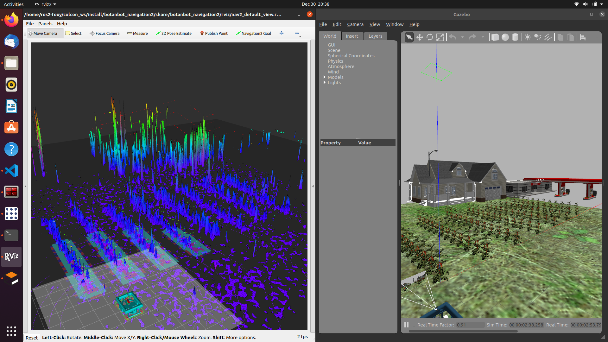

.. OUTDOOR_NAV2 documentation master file, created by
   sphinx-quickstart on Tue Dec 22 16:24:53 2020.
   You can adapt this file completely to your liking, but it should at least
   contain the root `toctree` directive.

Archived Packages
========================================

Note that the material covered in this page is not actively in use by vox_nav. 
However this is kept for archival purposes. Some of the packages may still be useful for future development.

------------ 

 **1. Related to Google Cartographer 3D SLAM**

Unfourtunately Cartographer has not been ported to ROS2 completely ATM. 
We can still create maps and visualize results, the `vox_nav_cartogrpaher` is correctly configured and tested. 
But the node named `cartographer_asset_writter` has not been ported,this node is used to 
recieve actual 3D map in .pcd or other formats, therefore we cannot exploit created map now. 
Hopefully soon enough this will be available. For exploting the actual maps created see the next SLAM options below this section.
We have added configuration package(`vox_nav_cartogrpaher`) in order to build 3D maps using google cartogrpaher.

In order to use the provided configuration package, 
one will ned to create ros2 bag files with required topics. 
For now we use 1 LIDAR and 1 IMU(Can be changed to 2 LIDAR in future). 
In order to record a bag file this the required topics, do the following; 

.. code-block:: bash
   
   ros2 bag record /velodyne_points /imu/data

A bag file will be created. Cartogrpaher expects that you define the rigid body 
transforms between sensor links and robot body frame(base_link). 
This transforms are defined in `archived_vox_nav_cartographer/urdf`. 
You might need to modify translation and roation between velodyne sensor and imu sensor 
for different setup. A strict calibration might not be necesarry between IMU and LIDAR. 

Also see the `cartogrpaher.launch.py` file and make sure the data topics are remapped correctly. 
After we have the bag file and configuration ready, we do the following to build the 3D map. 

.. code-block:: bash

   ros2 launch archived_vox_nav_cartographer cartographer.launch.py use_sim_time:=true bag_file:=${HOME}/rosbag2_2020_12_18-10_25_37/rosbag2_2020_12_18-10_25_37_0.db3

Wait for cartogrpaher to finish and do optimizations on the map. 

------------ 

**2. Related to LIDAR SLAM ROS2 3D PACKAGE**

As second(but primary for now) SLAM package we have [lidarslam_ros2](https://github.com/jediofgever/lidarslam_ros2) package. 
The package is able to generate nice maps(in city like envoirnments) based on GICP/NDT. 

This package will be auomatically cloned to workspace with the vcs tool. 
Following same fashion with google cartogrpaher, 
we need to record bag files and generate maps with data inside this bags. 
Assuming that we have recorded bag file that contains point cloud and imu(optional) with topic names `velodyne_points`, `imu/data`, we can generate maps with ;

.. code-block:: bash

   ros2 bag play -r 0.5 rosbag2_2020_12_18-10_25_37/
   ros2 launch lidarslam lidarslam.launch.py
   rviz2 -d src/lidarslam_ros2/lidarslam/rviz/mapping.rviz

Note; if the sensor topic names are different then you need to recorrect them in tha launch file `lidarslam.launch.py`
execute all commands in seperate terminals. 
Here are a few example maps crreated when vox_nav was taking a tour to gas station and retruning back. 

.. image:: ../images/slam_0.png
   :width: 700px
   :align: center
   :alt: rqt landing screen

.. image:: ../images/slam_1.png
   :width: 700px
   :align: center
   :alt: rqt landing screen

.. image:: ../images/slam_2.png
   :width: 700px
   :align: center
   :alt: rqt landing screen

------------ 

**3. Related to grid_map package**

`archived_vox_nav_grid_map` is a package that reads a prebuilt map in .pcd format and publishes grid_map with several layers(elevation,traversability).
The maps can be built with any SLAM algorithm, at the default we have openvslam though. 
There are several important parameters in configuration files of `archived_vox_nav_grid_map`. 

.. code-block:: yaml

   archived_vox_nav_grid_map_node:
   ros__parameters:
      resolution: 0.15
      pcd_file_full_path: /home/ros2-foxy/f.pcd
      map_frame: grid_map
      topic_name: grid_map
      map_publish_fps: 10
      min_points_in_cell: 1
      cloud_transform:
         translation:
         x: 0.0
         y: 0.0
         z: 0.5
         rotation: #intrinsic rotation X-Y-Z (r-p-y)sequence
         r: 3.14
         p: 1.57
         y: 1.57
      downsample_voxel_size: 0.01
      remove_outlier_mean_K: 50
      remove_outlier_stddev_threshold: 0.5

We should specify a full path to the pcd file here. There are Other important parameters related to transfrom of pcd. 
In openvslam the coordinate frames are not complying with standart ROS frames(x forward, y left, z upwards). Therefore we 
need to transfrom pcd to comply with standart ROS frames. 
There are also some PCL utilities to denoise pcd and get better map. Play with them to find best working in for each case. In simulation the above 
parameters leads to following grid maps depicted in pictures.

.. note:: we use tf_static_transform publisher to create a dedicated coordinate frame for grid_map. You can change the translation and rotation
          in mapping.launch.py. This is important, it gives us flexibility to align map with oher global localization such as GPS. But we do not have 
          done any work towards that yet.

.. code-block:: bash

   ros2 launch archived_vox_nav_grid_map archived_vox_nav_grid_map.launch.py 

.. image:: ../images/grid_map_0.png
   :width: 700px
   :align: center
   :alt: rqt landing screen

